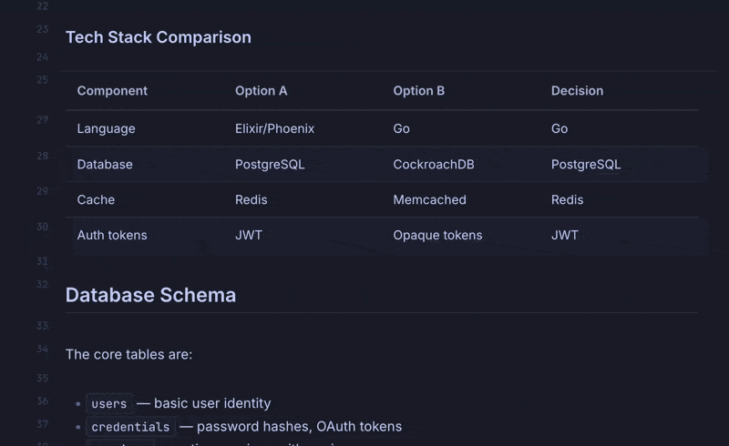
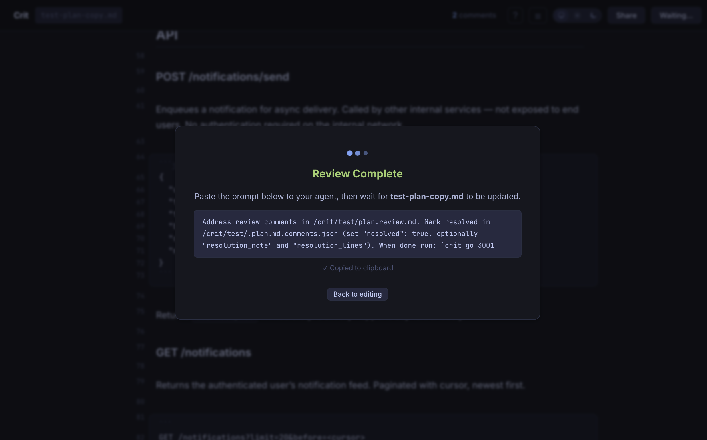

# Crit

A lightweight CLI tool for reviewing markdown plans with GitHub PR-style inline comments. Built for the workflow of iterating on plans with AI coding agents.

You write a plan in markdown. You run `crit` against it. You leave inline comments — single-line or multi-line ranges, just like a GitHub PR review. The tool writes a `.review.md` file in real-time with your comments interleaved, ready to hand back to your AI agent.

## Install

### Homebrew (macOS / Linux)

```bash
brew tap tomasz-tomczyk/tap
brew install crit
```

### Download Binary

Grab the latest binary for your platform from [Releases](https://github.com/tomasz-tomczyk/crit/releases).

## Usage

```bash
# Review a markdown file (opens browser automatically)
crit plan.md

# Specify a port
crit -p 3000 plan.md

# Don't auto-open browser
crit --no-open plan.md

# Custom output directory for .review.md
crit -o /tmp plan.md
```

## Features

### Comments for single lines and blocks


Generated Markdown:

```markdown
> **Note**: This plan covers the MVP scope. SAML integration is deferred to Phase 2
> unless the enterprise sales team escalates priority.

> **[REVIEW COMMENT — Lines 8-9]**: We should definitely defer SAML!

...

### Components

1. **Auth API** — handles login, logout, token refresh
2. **Token Service** — JWT issuance and validation
3. **Provider Adapters** — pluggable OAuth2/SAML providers
4. **Session Store** — Redis-backed session management

> **[REVIEW COMMENT — Lines 16-21]**: Can you be more specific here?
```

### Insert suggestion

Copies the selected lines for you to easily edit



### Mermaid diagram support


### Prompt agent when you're finished



### Other

- Real-time `.review.md` output updated on every comment change
- Live file watching with SSE — automatic reload when the source file changes
- Multi-round review workflow (review → finish → agent edits → new round)
- Syntax-highlighted code blocks (via highlight.js)
- Dark/light theme with persistence
- Single binary with embedded frontend

## Build from Source

Requires Go 1.25+ (install via [asdf](https://asdf-vm.com/), Homebrew, or [go.dev](https://go.dev/dl/)):

```bash
# Clone and build
git clone https://github.com/tomasz-tomczyk/crit.git
cd crit
go build -o crit .

# Optionally move to your PATH
mv crit /usr/local/bin/
```

### Cross-compile

```bash
make build-all
# Outputs to dist/:
#   crit-darwin-arm64
#   crit-darwin-amd64
#   crit-linux-amd64
#   crit-linux-arm64
```

## Workflow

```bash
# 1. AI agent generates a plan
agent "Write a plan for the new auth service" > auth-plan.md

# 2. Review it
crit auth-plan.md
# → Leave comments in the browser
# → Click "Finish Review" — prompt copied to clipboard

# 3. Hand the review back to your agent
# (paste the clipboard, or:)
agent "I've left review comments in auth-plan.review.md — please address
       each comment and update the plan accordingly."

# 4. The file watcher detects changes, reloads automatically
# → New round starts, leave more comments, repeat
```

### Live Reload

Crit watches the source file for changes. After you click "Finish Review" and your agent edits the file, the browser automatically reloads with the updated content and clears previous comments for a fresh review round.

### Output Files

| File                  | Purpose                                                         |
| --------------------- | --------------------------------------------------------------- |
| `plan.review.md`      | Original plan + comments as blockquotes — hand to your AI agent |
| `.plan.comments.json` | Hidden file for session resume (auto-managed)                   |

## Claude Code Integration

Crit ships with a built-in [Claude Code](https://docs.anthropic.com/en/docs/claude-code) slash command that automates the review loop.

### Usage

In Claude Code, while working with a plan:

```
/review-plan              # Auto-detects the current plan file
/review-plan my-plan.md   # Review a specific file
```

### What it does

1. Finds the plan file (from session context, argument, `~/.claude/plans/`, or current directory)
2. Launches `crit` in the background
3. Waits for you to leave comments in the browser
4. Reads the review output and addresses each comment by editing the plan
5. The file change triggers crit's live reload for another round

This turns plan review into a tight loop: comment in the browser, Claude addresses feedback, review again.

### Requirements

- `crit` must be installed and on your `PATH`
- Claude Code v1.0+

## Acknowledgments

Crit embeds the following open-source libraries:

- [markdown-it](https://github.com/markdown-it/markdown-it) — Markdown parser
- [highlight.js](https://github.com/highlightjs/highlight.js) — Syntax highlighting
- [Mermaid](https://github.com/mermaid-js/mermaid) — Diagram rendering
