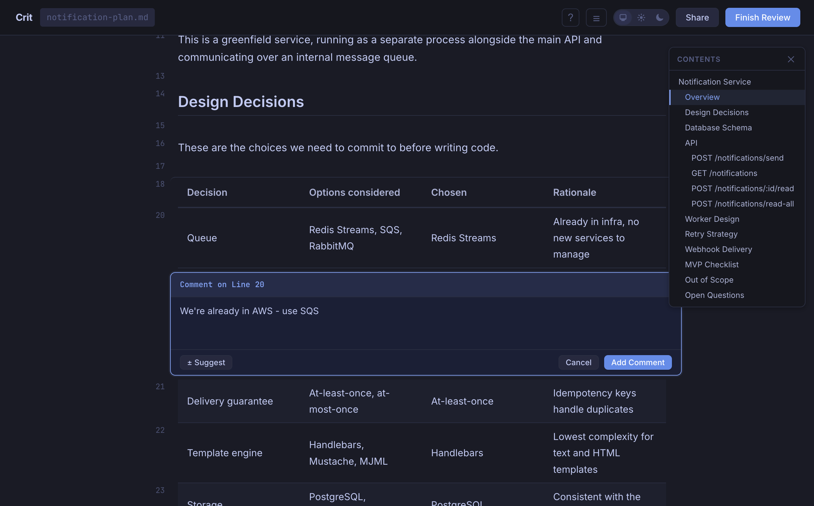
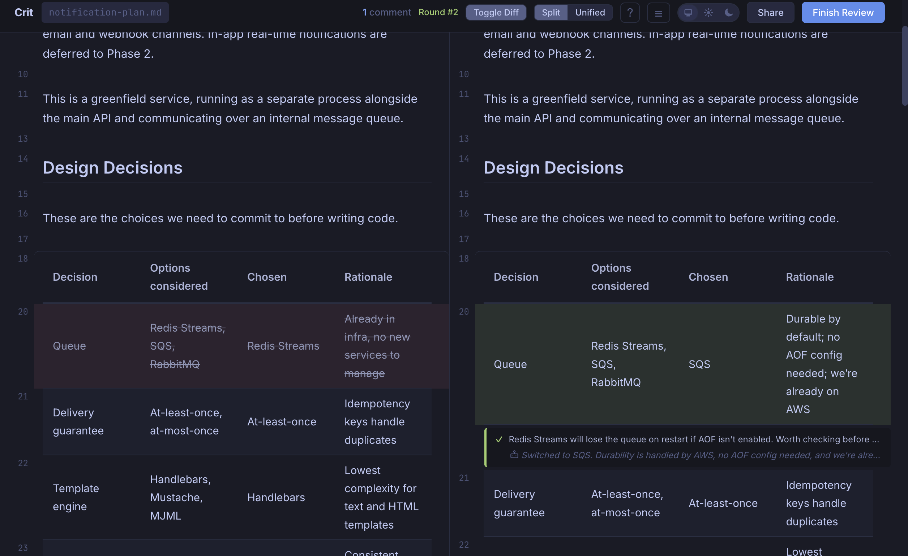
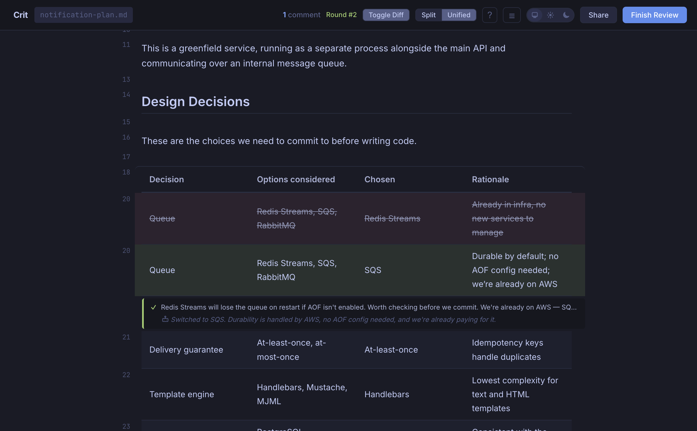

# Crit

Don't let your agent build the wrong thing.

Your agent wrote a plan. Before it starts rewriting your codebase, review that plan. Crit opens any markdown file as a reviewable document - leave inline comments, finish the review, and a prompt goes to your clipboard telling the agent what to fix.

Works with Claude Code, Cursor, GitHub Copilot, Aider, Cline, Windsurf, or any agent that reads files.



## Workflow

```bash
# 1. Open a plan for review
crit plan.md
# → Browser opens with the plan rendered and commentable
# → Select lines, leave inline comments

# 2. Click "Finish Review"
# → Crit writes plan.review.md and .plan.comments.json
# → A prompt is copied to your clipboard telling the agent what to do

# 3. Paste the prompt into your agent
# → The prompt points the agent to the review file, the comments file,
#   and tells it to run `crit go <port>` when done

# 4. Agent edits the plan and runs `crit go <port>`
# → Crit starts a new round with a diff of what changed
# → Previous comments show as resolved or still open
# → Leave more comments, repeat until the plan is right
```

### Output

When you finish a review, Crit generates two files:

| File                  | Purpose                                                                                       |
| --------------------- | --------------------------------------------------------------------------------------------- |
| `plan.review.md`      | Original plan with your comments interleaved as blockquotes at the exact lines they reference |
| `.plan.comments.json` | Comment state and session data. The agent marks comments resolved here                        |

## Demo

A 2-minute walkthrough: reviewing a plan, leaving inline comments, handing off to an agent. Note: slightly outdated as we're moving fast :D

[](https://www.youtube.com/watch?v=w_Dswm2Ft-o)

## Install

### Homebrew (macOS / Linux)

```bash
brew install tomasz-tomczyk/tap/crit
```

### Go

```bash
go install github.com/tomasz-tomczyk/crit@latest
```

### Nix

```bash
nix profile install github:tomasz-tomczyk/crit
```

Or in a `flake.nix`:

```nix
inputs.crit.url = "github:tomasz-tomczyk/crit";
```

### Download Binary

Grab the latest binary for your platform from [Releases](https://github.com/tomasz-tomczyk/crit/releases).

## Features

### Round-to-round diff

After your agent edits the file, Crit shows a split or unified diff of what changed - toggle it in the header.

#### Split view



#### Unified view



### Inline comments: single lines and ranges

Click a line number to comment. Drag to select a range. Comments are rendered inline after their referenced lines, just like a GitHub PR review.


### Suggestion mode

Select lines and use "Insert suggestion" to pre-fill the comment with the original text. Edit it to show exactly what the replacement should look like. Your agent gets a concrete before/after.


### Share for async review

Want a second opinion before handing off to the agent? The Share button uploads your review to [crit.live](https://crit.live) and gives you a public URL anyone can open in a browser, no install needed. Each reviewer's comments are color-coded by author. Unpublish anytime.

### Finish review: prompt copied to clipboard

When you click "Finish Review", Crit collects your comments, formats them into a prompt, and copies it to your clipboard. Paste directly into your agent.


### Mermaid diagrams

Architecture diagrams in fenced ` ```mermaid ` blocks render inline. You can comment on the diagram source just like any other block.


### Everything else

- **Single binary.** No daemon, no Docker, no dependencies. `brew install` and you're done.
- **Draft autosave.** Close your browser mid-review and pick up exactly where you left off.
- **Vim keybindings.** `j`/`k` to navigate, `c` to comment, `Shift+F` to finish. `?` for the full reference.
- **Concurrent reviews.** Each instance runs on its own port - review multiple plans at once.
- **Syntax highlighting.** Code blocks are highlighted and split per-line, so you can comment on individual lines inside a fence.
- **Live file watching.** The browser reloads automatically when the source file changes.
- **Real-time output.** `.review.md` is written on every keystroke (200ms debounce), so your agent always has the latest state.
- **Dark/light/system theme.** Three-button pill in the header, persisted to localStorage.
- **Local by default.** Server binds to `127.0.0.1`. Your files stay on your machine unless you explicitly share.

## Agent Integrations

Crit ships with drop-in configuration files for popular AI coding tools. Each one teaches your agent to write a plan, launch `crit` for review, and wait for your feedback before implementing.

The fastest way to set up an integration:

```bash
crit install claude-code   # or: cursor, windsurf, github-copilot, cline
crit install all           # install all integrations at once
```

This copies the right files to the right places in your project. Safe to re-run - existing files are skipped (use `--force` to overwrite).

Or set up manually:

| Tool               | Setup                                                                                 |
| ------------------ | ------------------------------------------------------------------------------------- |
| **Claude Code**    | Copy `integrations/claude-code/crit.md` to `.claude/commands/crit.md`                 |
| **Cursor**         | Copy `integrations/cursor/crit-command.md` to `.cursor/commands/crit.md`              |
| **GitHub Copilot** | Copy `integrations/github-copilot/crit.prompt.md` to `.github/prompts/crit.prompt.md` |
| **Windsurf**       | Copy `integrations/windsurf/crit.md` to `.windsurf/rules/crit.md`                     |
| **Aider**          | Append `integrations/aider/CONVENTIONS.md` to your `CONVENTIONS.md`                   |
| **Cline**          | Copy `integrations/cline/crit.md` to `.clinerules/crit.md`                            |

See [`integrations/`](integrations/) for the full files and details.

### `/crit` command

Claude Code, Cursor, and GitHub Copilot support a `/crit` slash command that automates the full review loop:

```
/crit              # Auto-detects the current plan file
/crit my-plan.md   # Review a specific file
```

It launches Crit, waits for your review, reads your comments, revises the plan, and signals Crit for another round. Other tools use rules files that teach the agent to suggest Crit when writing plans.

## Usage

```bash
# Review a markdown file (opens browser automatically)
crit plan.md

# Specify a port
crit -p 3000 plan.md

# Don't auto-open browser
crit --no-open plan.md

# Custom output directory for .review.md
crit -o /tmp plan.md
```

## Environment Variables

| Variable               | Description                                                                                |
| ---------------------- | ------------------------------------------------------------------------------------------ |
| `CRIT_SHARE_URL`       | Override the Share button URL (defaults to crit.live, useful for self-hosted or local dev) |
| `CRIT_NO_UPDATE_CHECK` | Set to any value to disable the update check on startup                                    |

## Build from Source

Requires Go 1.25+ (install via [asdf](https://asdf-vm.com/), Homebrew, or [go.dev](https://go.dev/dl/)):

```bash
# Clone and build
git clone https://github.com/tomasz-tomczyk/crit.git
cd crit
go build -o crit .

# Optionally move to your PATH
mv crit /usr/local/bin/
```

### Cross-compile

```bash
make build-all
# Outputs to dist/:
#   crit-darwin-arm64
#   crit-darwin-amd64
#   crit-linux-amd64
#   crit-linux-arm64
```

### E2E Tests

The `e2e/` directory has a Playwright test suite that runs the full frontend against a real Crit server. Requires Node.js (listed in `mise.toml`).

```bash
cd e2e && npm install && npx playwright install chromium

make e2e                                              # Run full suite
cd e2e && npx playwright test tests/comments.spec.ts  # Run one test file
cd e2e && npx playwright test --headed                # Run with visible browser
make e2e-report                                       # View HTML report
```

## Acknowledgments

Crit embeds the following open-source libraries:

- [markdown-it](https://github.com/markdown-it/markdown-it): Markdown parser
- [highlight.js](https://github.com/highlightjs/highlight.js): Syntax highlighting
- [Mermaid](https://github.com/mermaid-js/mermaid): Diagram rendering
