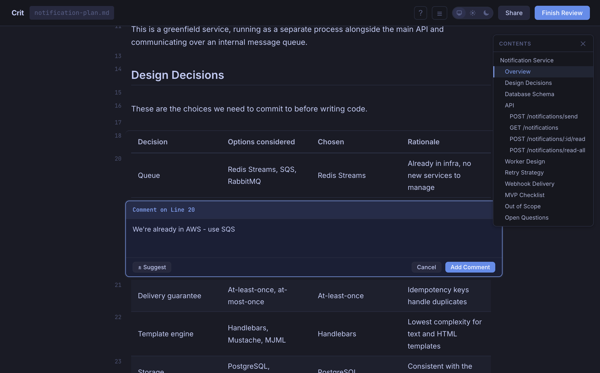
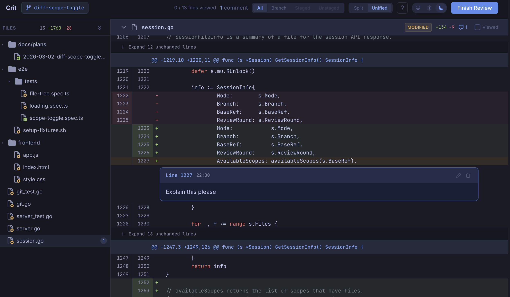
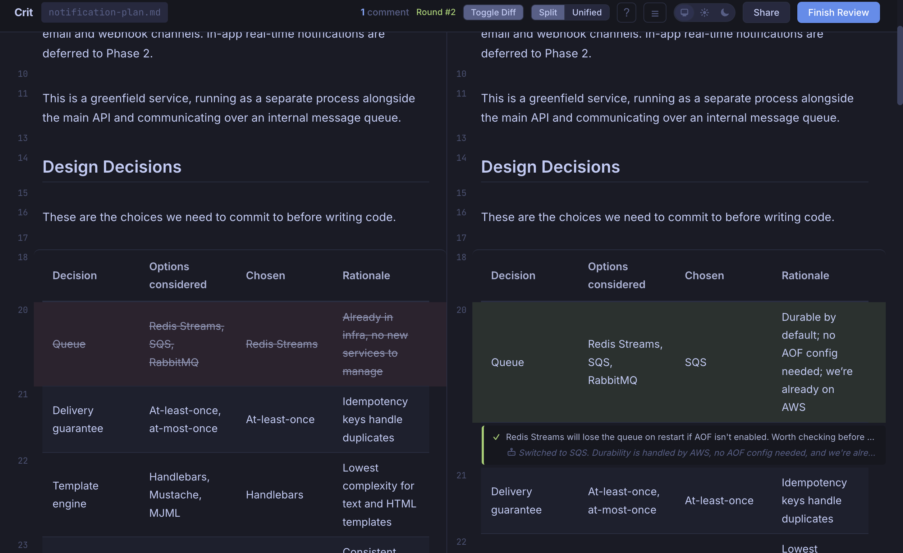
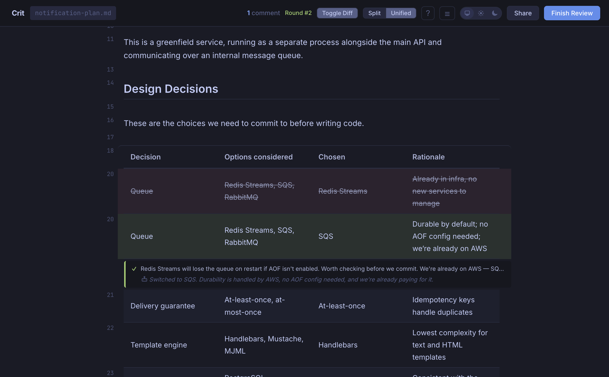
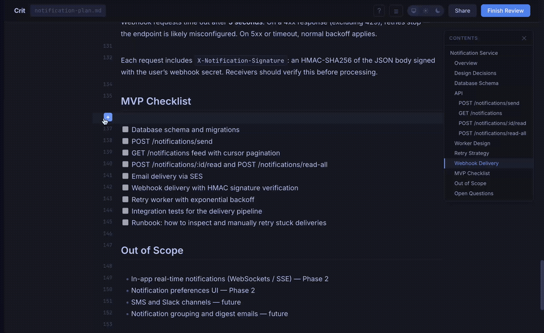
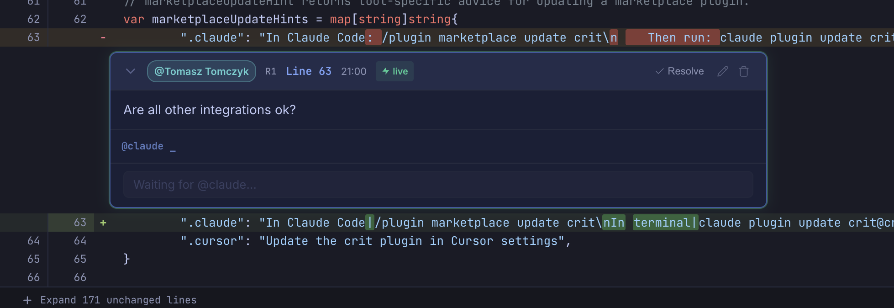

# Crit

[](https://github.com/tomasz-tomczyk/crit/actions/workflows/test.yml)
[](https://github.com/tomasz-tomczyk/crit/releases)
[](https://goreportcard.com/report/github.com/tomasz-tomczyk/crit)
[](LICENSE)

Reviewing agent output in a terminal is painful. You can't point at a specific line and say "change this." When your agent updates the file, you re-read the whole thing to figure out what changed.

Crit opens your file in a browser with GitHub-style inline comments. Leave feedback, hit Finish, and your agent is notified automatically. When the agent edits, Crit shows a diff between rounds - you see exactly what it addressed.

Works with Claude Code, Cursor, GitHub Copilot, Aider, Cline, Windsurf and any other agent.

## Why Crit

- **Browser UI, not terminal.** A persistent tab with rendered markdown and visual diffs.
- **Single binary, zero dependencies.** `brew install` and you're done.
- **Round-to-round diffs.** See exactly what your agent changed between iterations. See previous comments to make sure they're addressed.
- **Works with any agent.** Not locked to one AI provider.



## Install

```bash
brew install tomasz-tomczyk/tap/crit
```

Also available via [Go, Nix, or binary download](#other-install-methods).

## Agent Integrations

Crit ships with plugins and configuration files for popular AI coding tools.

See [`integrations/`](integrations/) for all install methods and details.

### Plugin install (Claude Code)

For the full experience - installs globally with a `/crit` command plus a `crit` skill that auto-activates when your agent works with review files, `crit comment`, `crit pull/push`, etc:

```
/plugin marketplace add tomasz-tomczyk/crit
/plugin install crit
```

### `/crit` command

Claude Code, Cursor, OpenCode, and GitHub Copilot support a `/crit` slash command that automates the full review loop.

It launches Crit, waits for your review; your agent acts on the feedback and you go back and forth until the work is approved.

## Demo

A 2-minute walkthrough of plan review and branch review.

[](https://www.youtube.com/watch?v=LHwfdvePf5A)

## Usage

The recommended way is to use `/crit` command with your agent after any piece of work - whether it wrote a plan or made some code changes. You can however, launch it in your terminal by yourself and paste the prompt when you finish to your agent.

```bash
crit                          # auto-detect changed files in your repo
crit plan.md                  # review a specific file
crit plan.md api-spec.md      # review multiple files
crit status                   # show review file path and daemon status
crit cleanup                  # delete stale review files
```

## Features

### File review

Pass specific files to review them directly: `crit plan.md api-spec.md`. Markdown files render as formatted documents with per-line commenting. Code files show as syntax-highlighted source. Both support the same inline comment workflow and multi-round iteration.

### Git review

Run `crit` with no arguments. Crit auto-detects changed files in your repo and opens them as syntax-highlighted git diffs. A file tree on the left shows every file with its status (added, modified, deleted) and comment counts. Toggle between split and unified diff views.



### Round-to-round diff

After your agent edits the file, Crit shows a split or unified diff of what changed - toggle it in the header.

#### Split view



#### Unified view



### Inline comments: single lines and ranges

Click a line number to comment. Drag to select a range. Comments are rendered inline after their referenced lines, just like a GitHub PR review.



### Suggestion mode

Select lines and use "Insert suggestion" to pre-fill the comment with the original text. Edit it to show exactly what the replacement should look like. Your agent gets a concrete before/after.

### Finish review: agent notified automatically

When you click "Finish Review", Crit writes the review file and notifies your agent If your agent was listening, it picks up the prompt automatically - no copy-paste needed.

### Programmatic comments

AI agents can use `crit comment` to add inline review comments without opening the browser UI or constructing JSON manually:

```bash
crit comment src/auth.go:42 'Missing null check'
crit comment src/handler.go:15-28 'Error handling issue'
crit comment --output /tmp/reviews src/auth.go:42 'comment'  # custom output dir
crit comment --clear   # remove the review file
```

Comments are appended to the review file (stored in `~/.crit/reviews/`) and created automatically if it doesn't exist. Run `crit status` to see the active review file path.

### Mermaid diagrams

Architecture diagrams in fenced ` ```mermaid ` blocks render inline. You can comment on the diagram source just like any other block.

### Share for Async Review

Want a second opinion before handing off to the agent? Click the Share button to upload your review and get a public URL anyone can open in a browser, no install needed. Each reviewer's comments are color-coded by author. Unpublish anytime.

You can also share directly from the CLI without starting the browser UI:

```bash
crit share plan.md                    # share files and print the URL
crit share plan.md --qr               # also print a QR code in the terminal
crit unpublish                        # remove the shared review
```

Sharing uses [crit.md](https://crit.md) by default. To self-host, deploy [`crit-web`](https://github.com/tomasz-tomczyk/crit-web) and point `CRIT_SHARE_URL` (or `--share-url`, or `share_url` in config) at your instance. Set `share_url` to `""` to disable sharing entirely.

#### Authentication

You can share anonymously or you can create a free crit.md account (using GitHub oAuth). To authenticate with crit-web (for sharing and other features that require an account):

```bash
crit auth login                    # opens browser to log in
crit auth whoami                   # show current user info
crit auth logout                   # log out and revoke token
```

`crit auth login` uses the OAuth Device Flow - it opens your browser, you confirm, and the CLI receives a token automatically. The token is stored in your global config (`~/.crit.config.json`).

### GitHub PR Sync

Crit can sync review comments bidirectionally with GitHub PRs. Requires the [GitHub CLI](https://cli.github.com) (`gh`) to be installed and authenticated.

#### Pull comments from a PR

```bash
crit pull              # auto-detects PR from current branch
crit pull 42           # explicit PR number
```

#### Push comments to a PR

```bash
crit push                          # auto-detects PR from current branch
crit push --dry-run                # preview without posting
crit push --message "Round 2"      # add a top-level review comment
crit push 42                       # explicit PR number
```

### Send to agent (experimental)

Click "Send now" on any comment during a review to get an AI agent response in real-time. This feature only appears when `agent_cmd` is configured.
The agent reads the comment context, addresses it (editing code if needed), and replies
inline - all while you continue reviewing.



Configure in `~/.crit.config.json` (global config only):

```json
{
  "agent_cmd": "claude --dangerously-skip-permissions -p"
}
```

> **Security note:** `agent_cmd` is read exclusively from your global `~/.crit.config.json`. Project-level `.crit.config.json` files cannot set it. This prevents a malicious repository from executing arbitrary commands when you trigger "Send to agent".

#### Permission modes

Agents need tool permissions to edit files on your behalf. How you grant them depends on your trust level:

| Mode             | Command                                                   | What the agent can do                                                                       |
| ---------------- | --------------------------------------------------------- | ------------------------------------------------------------------------------------------- |
| Full access      | `claude --dangerously-skip-permissions -p`                | Read, write, and run any tool. Simplest option - recommended for trusted repos.             |
| Selective access | `claude --allowedTools Edit,Read,Bash,Write,Glob,Grep -p` | Only the listed tools are permitted. Good middle ground.                                    |
| No permissions   | `claude -p`                                               | The agent can respond to comments but **cannot edit files**. Useful for Q&A-only workflows. |

#### How it works

1. The agent receives the comment text, quoted text (if text was selected), file path, and line range on **stdin**.
2. The agent's **stdout** is captured and posted as a reply to the comment automatically.
3. If the agent edits files, Crit detects the changes via **file watching** and updates the UI.

#### Live threads

After the first agent interaction, the comment becomes a **live thread**:

- Further replies you post in the thread are automatically sent to the agent - no need to click "Send to agent" again.
- The agent sees the **full conversation history**, so it can build on previous context.
- Live threads show a ⚡ **live** badge and green glow - the agent will respond immediately to further replies.

#### Supported agents

| Agent                 | `agent_cmd` value        |
| --------------------- | ------------------------ |
| Claude Code           | `claude -p`              |
| OpenCode              | `opencode ask`           |
| Cline                 | `cline --pipe`           |
| Aider                 | `aider --message-file -` |
| Cursor (experimental) | `cursor --pipe`          |

> **Tip:** Claude Code still prompts for permission in `-p` mode. To let it edit files freely, use `claude --dangerously-skip-permissions -p` instead. The other agents already operate without permission prompts in their pipe/non-interactive modes.
>
> You can also specify a model with `--model` (e.g. `claude --model sonnet -p`).

### Everything else

- **Per-branch review isolation.** Each branch gets its own review file — switch branches freely without losing comments. Review data lives in `~/.crit/reviews/`, not your repo.
- **Draft autosave.** Close your browser mid-review and pick up exactly where you left off.
- **Vim keybindings.** `j`/`k` to navigate, `c` to comment, `Shift+F` to finish. `?` for the full reference.
- **Concurrent reviews.** Each instance runs on its own port - review multiple plans at once.
- **Syntax highlighting.** Code blocks are highlighted and split per-line, so you can comment on individual lines inside a fence.
- **Live file watching.** The browser reloads automatically when the source file changes.
- **Dark/light/system theme.** Three-button pill in the header, persisted to localStorage.
- **Local by default.** Server binds to `127.0.0.1`. Your files stay on your machine unless you explicitly share.
- **No analytics or tracking.** Crit collects zero telemetry. No usage stats, no crash reports, no phone-home. If we ever add anonymous usage statistics in the future, they will be explicitly opt-in.
- **Update check.** On startup, Crit makes one network request to check for a newer version and prints a notice if one is available. Set `CRIT_NO_UPDATE_CHECK=1` to disable it.

## Configuration

Crit supports persistent configuration via JSON files so you don't have to pass the same flags every time.

| File                  | Scope   | Location                                         |
| --------------------- | ------- | ------------------------------------------------ |
| `~/.crit.config.json` | Global  | Applies to all projects                          |
| `.crit.config.json`   | Project | Repo root (from `git rev-parse --show-toplevel`) |

Project config overrides global. CLI flags and env vars override both.

```bash
crit config --generate > ~/.crit.config.json   # scaffold a starter config file
crit config                                    # view resolved config (merged global + project)
```

### Config keys

All keys are optional — omit any you don't need.

| Key                    | Type     | Default                    | Description                                                                                                                                                                             |
| ---------------------- | -------- | -------------------------- | --------------------------------------------------------------------------------------------------------------------------------------------------------------------------------------- |
| `port`                 | int      | `0` (random)               | Port for the local server. `0` picks a random available port.                                                                                                                           |
| `no_open`              | bool     | `false`                    | Don't auto-open the browser when starting a review.                                                                                                                                     |
| `share_url`            | string   | `"https://crit.md"`        | Base URL of the share service. Set to `""` to disable sharing entirely. Self-host with [`crit-web`](https://github.com/tomasz-tomczyk/crit-web).                                        |
| `quiet`                | bool     | `false`                    | Suppress terminal status output.                                                                                                                                                        |
| `output`               | string   | repo root or file dir      | Output directory for review files. Reviews are stored in `~/.crit/reviews/` by default.                                                                                                 |
| `author`               | string   | `git config user.name`     | Author name shown on comments. Falls back to your git user name.                                                                                                                        |
| `base_branch`          | string   | auto-detected              | Base branch to diff against (e.g. `"main"`, `"develop"`). Overrides auto-detection.                                                                                                     |
| `ignore_patterns`      | string[] | `[".crit/"]` | File patterns to exclude from git-mode file lists. Global and project patterns are merged.                                                                                              |
| `agent_cmd`            | string   | `""`                       | Shell command for "Send to agent" (e.g. `"claude -p"`). **Global config only** — project config cannot set this for security reasons. See [Send to agent](#send-to-agent-experimental). |
| `auth_token`           | string   | `""`                       | Authentication token for crit.md. Set automatically by `crit auth login`. **Global config only.**                                                                                       |
| `cleanup_on_approve`   | bool     | `true`                     | Automatically delete the review file when you approve with no unresolved comments. Set to `false` to preserve review history.                                                           |
| `no_update_check`      | bool     | `false`                    | Don't check for new versions on startup.                                                                                                                                                |
| `no_integration_check` | bool     | `false`                    | Skip the integration config freshness check on startup.                                                                                                                                 |

### CLI flags

| Flag            | Short | Equivalent config key | Description                            |
| --------------- | ----- | --------------------- | -------------------------------------- |
| `--port`        | `-p`  | `port`                | Port to listen on                      |
| `--no-open`     |       | `no_open`             | Don't auto-open browser                |
| `--share-url`   |       | `share_url`           | Share service URL                      |
| `--output`      | `-o`  | `output`              | Output directory for review files      |
| `--quiet`       | `-q`  | `quiet`               | Suppress status output                 |
| `--base-branch` |       | `base_branch`         | Base branch to diff against            |
| `--no-ignore`   |       |                       | Temporarily bypass all ignore patterns |
| `--version`     | `-v`  |                       | Print version and exit                 |

### Ignore patterns

Patterns from global and project configs are merged. Supported syntax:

| Pattern             | Matches                                         |
| ------------------- | ----------------------------------------------- |
| `*.lock`            | Files ending in `.lock` anywhere in tree        |
| `vendor/`           | All files under `vendor/`                       |
| `package-lock.json` | Exact filename anywhere in tree                 |
| `generated/*.pb.go` | Path prefix with glob (`filepath.Match` syntax) |

Use `--no-ignore` to temporarily bypass all patterns:

```bash
crit --no-ignore
```

### Environment variables

| Variable                    | Description                                       |
| --------------------------- | ------------------------------------------------- |
| `CRIT_PORT`                 | Default port for the local server                 |
| `CRIT_SHARE_URL`            | Override the share service URL                    |
| `CRIT_AUTH_TOKEN`           | Override the auth token (skips `crit auth login`) |
| `CRIT_NO_UPDATE_CHECK`      | Disable the update check on startup               |
| `CRIT_NO_INTEGRATION_CHECK` | Skip integration config freshness checks          |

## Other Install Methods

### Build from Source

Requires Go 1.26+:

```bash
git clone https://github.com/tomasz-tomczyk/crit.git
cd crit
go build -o crit .
mv crit /usr/local/bin/
```

### Go

```bash
go install github.com/tomasz-tomczyk/crit@latest
```

### Nix

```bash
nix run github:tomasz-tomczyk/crit -- --help
```

Or add it to a `flake.nix`:

```nix
inputs.crit.url = "github:tomasz-tomczyk/crit";
```

### Download Binary

Grab the latest binary for your platform from [Releases](https://github.com/tomasz-tomczyk/crit/releases).

## Acknowledgements

Crit embeds the following open-source libraries:

- [markdown-it](https://github.com/markdown-it/markdown-it): Markdown parser
- [highlight.js](https://github.com/highlightjs/highlight.js): Syntax highlighting
- [Mermaid](https://github.com/mermaid-js/mermaid): Diagram rendering
