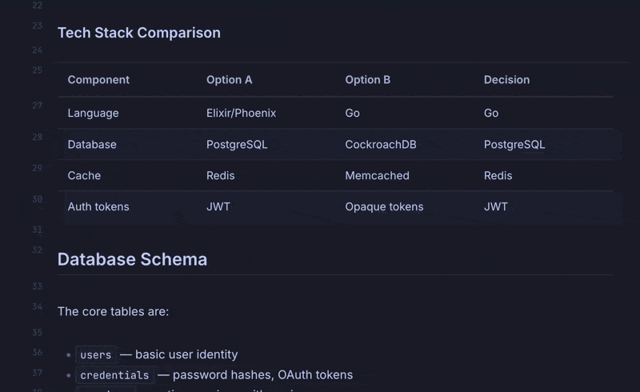
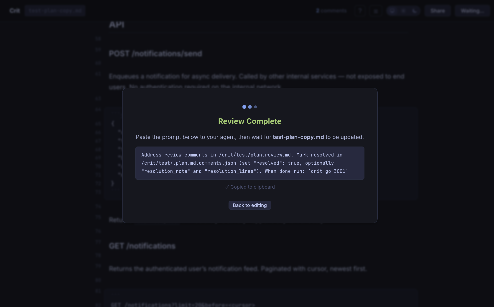
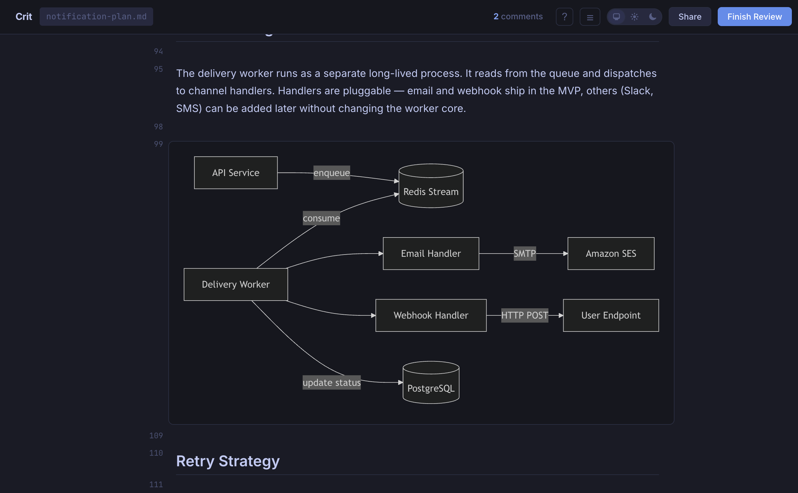

# Crit

Reviewing agent output in a terminal is painful. You can't point at a specific line and say "change this." When your agent updates the file, you re-read the whole thing to figure out what changed.

Crit opens your file in a browser with GitHub-style inline comments. Leave feedback, hit Finish, and a structured prompt goes to your clipboard. Paste it back. When the agent edits, Crit shows a diff between rounds — you see exactly what it addressed.

Works with Claude Code, Cursor, GitHub Copilot, Aider, Cline, Windsurf — any agent that reads files.

## Why Crit

- **Browser UI, not terminal.** A persistent tab with rendered markdown and visual diffs. No tmux, no TUI.
- **Single binary, zero dependencies.** `brew install` and you're done. No daemon, no Docker, no MCP.
- **Round-to-round diffs.** See exactly what your agent changed between iterations. Previous comments show as resolved or still open.
- **Works with any agent.** Not locked to one editor or AI provider. Anything that reads files works.


## Install

```bash
brew install tomasz-tomczyk/tap/crit
```

Also available via [Go, Nix, or binary download](#other-install-methods).

## Demo

A 5-minute walkthrough of plan review and branch review.

[](https://www.youtube.com/watch?v=XRjkRpXuLJc)

## Features

### Git review

Run `crit` with no arguments. Crit auto-detects changed files in your repo and opens them as syntax-highlighted git diffs. A file tree on the left shows every file with its status (added, modified, deleted) and comment counts. Toggle between split and unified diff views.


### File review

Pass specific files to review them directly: `crit plan.md api-spec.md`. Markdown files render as formatted documents with per-line commenting. Code files show as syntax-highlighted source. Both support the same inline comment workflow and multi-round iteration.

### Round-to-round diff

After your agent edits the file, Crit shows a split or unified diff of what changed - toggle it in the header.

#### Split view


#### Unified view


### Inline comments: single lines and ranges

Click a line number to comment. Drag to select a range. Comments are rendered inline after their referenced lines, just like a GitHub PR review.


### Suggestion mode

Select lines and use "Insert suggestion" to pre-fill the comment with the original text. Edit it to show exactly what the replacement should look like. Your agent gets a concrete before/after.



### Finish review: prompt copied to clipboard

When you click "Finish Review", Crit collects your comments, formats them into a prompt, and copies it to your clipboard. Paste directly into your agent.



### GitHub PR Sync

Crit can sync review comments bidirectionally with GitHub PRs. Requires the [GitHub CLI](https://cli.github.com) (`gh`) to be installed and authenticated.

#### Pull comments from a PR

```bash
crit pull              # auto-detects PR from current branch
crit pull 42           # explicit PR number
```

#### Push comments to a PR

```bash
crit push                          # auto-detects PR from current branch
crit push --dry-run                # preview without posting
crit push --message "Round 2"      # add a top-level review comment
crit push 42                       # explicit PR number
```

### Programmatic comments

AI agents can use `crit comment` to add inline review comments without opening the browser UI or constructing JSON manually:

```bash
crit comment src/auth.go:42 'Missing null check'
crit comment src/handler.go:15-28 'Error handling issue'
crit comment --output /tmp/reviews src/auth.go:42 'comment'  # custom output dir
crit comment --clear   # remove .crit.json
```

Comments are appended to `.crit.json` — created automatically if it doesn't exist. Run `crit install <agent>` to install the integration, which includes a `crit-comment` skill file teaching your agent the syntax.

### Mermaid diagrams

Architecture diagrams in fenced ` ```mermaid ` blocks render inline. You can comment on the diagram source just like any other block.



### Everything else

- **Draft autosave.** Close your browser mid-review and pick up exactly where you left off.
- **Vim keybindings.** `j`/`k` to navigate, `c` to comment, `Shift+F` to finish. `?` for the full reference.
- **Concurrent reviews.** Each instance runs on its own port - review multiple plans at once.
- **Syntax highlighting.** Code blocks are highlighted and split per-line, so you can comment on individual lines inside a fence.
- **Live file watching.** The browser reloads automatically when the source file changes.
- **Real-time output.** `.crit.json` is written on every comment change (200ms debounce), so your agent always has the latest review state.
- **Dark/light/system theme.** Three-button pill in the header, persisted to localStorage.
- **Local by default.** Server binds to `127.0.0.1`. Your files stay on your machine unless you explicitly share.

## Agent Integrations

Crit ships with drop-in configuration files for popular AI coding tools. Each one teaches your agent to write a plan, launch `crit` for review, and wait for your feedback before implementing.

The fastest way to set up an integration:

```bash
crit install claude-code   # or: cursor, opencode, windsurf, github-copilot, cline
crit install all           # install all integrations at once
```

This copies the right files to the right places in your project. Safe to re-run - existing files are skipped (use `--force` to overwrite).

Or set up manually:

| Tool               | Setup                                                                                 |
| ------------------ | ------------------------------------------------------------------------------------- |
| **Claude Code**    | Copy `integrations/claude-code/crit.md` to `.claude/commands/crit.md`                 |
| **Cursor**         | Copy `integrations/cursor/crit-command.md` to `.cursor/commands/crit.md`              |
| **OpenCode**       | Copy `integrations/opencode/crit.md` to `.opencode/commands/crit.md`                  |
| **OpenCode**       | Copy `integrations/opencode/SKILL.md` to `.opencode/skills/crit-review/SKILL.md`      |
| **GitHub Copilot** | Copy `integrations/github-copilot/crit.prompt.md` to `.github/prompts/crit.prompt.md` |
| **Windsurf**       | Copy `integrations/windsurf/crit.md` to `.windsurf/rules/crit.md`                     |
| **Aider**          | Append `integrations/aider/CONVENTIONS.md` to your `CONVENTIONS.md`                   |
| **Cline**          | Copy `integrations/cline/crit.md` to `.clinerules/crit.md`                            |

See [`integrations/`](integrations/) for the full files and details.

### `/crit` command

Claude Code, Cursor, OpenCode, and GitHub Copilot support a `/crit` slash command that automates the full review loop:

```
/crit              # Auto-detects the current plan file
/crit my-plan.md   # Review a specific file
```

It launches Crit, waits for your review, reads your comments, revises the plan, and signals Crit for another round. OpenCode also ships with a `crit-review` skill that agents can load on demand. Other tools use rules files that teach the agent to suggest Crit when writing plans.

## Usage

```bash
crit                          # auto-detect changed files in your repo
crit plan.md                  # review a specific file
crit plan.md api-spec.md      # review multiple files
crit -p 3000 plan.md          # specify a port
crit --no-open plan.md        # don't auto-open browser
```

When you finish a review, Crit writes `.crit.json` — structured comment data your agent reads and acts on. Add it to your `.gitignore`:

```bash
echo '.crit.json' >> .gitignore
```

## Share for Async Review

Want a second opinion before handing off to the agent? Enable sharing by setting `CRIT_SHARE_URL=https://crit.live` (or pass `--share-url`), then click the Share button to upload your review and get a public URL anyone can open in a browser, no install needed. Each reviewer's comments are color-coded by author. Unpublish anytime.

<details id="other-install-methods">
<summary>Other install methods</summary>

### Go

```bash
go install github.com/tomasz-tomczyk/crit@latest
```

### Nix

```bash
nix run github:tomasz-tomczyk/crit -- --help
```

Or add it to a `flake.nix`:

```nix
inputs.crit.url = "github:tomasz-tomczyk/crit";
```

### Download Binary

Grab the latest binary for your platform from [Releases](https://github.com/tomasz-tomczyk/crit/releases).

</details>

<details>
<summary>Environment variables</summary>

| Variable               | Description                                                                                |
| ---------------------- | ------------------------------------------------------------------------------------------ |
| `CRIT_SHARE_URL`       | Enable the Share button (e.g. `https://crit.live` or a self-hosted instance) |
| `CRIT_NO_UPDATE_CHECK` | Set to any value to disable the update check on startup                                    |

</details>
