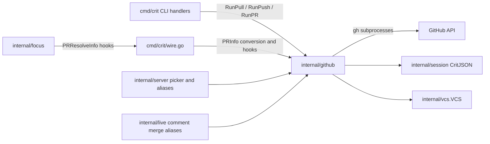
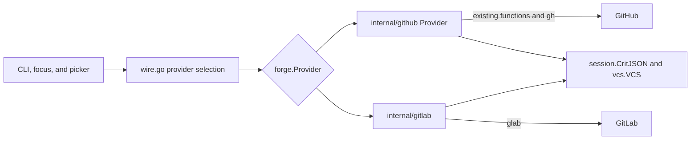
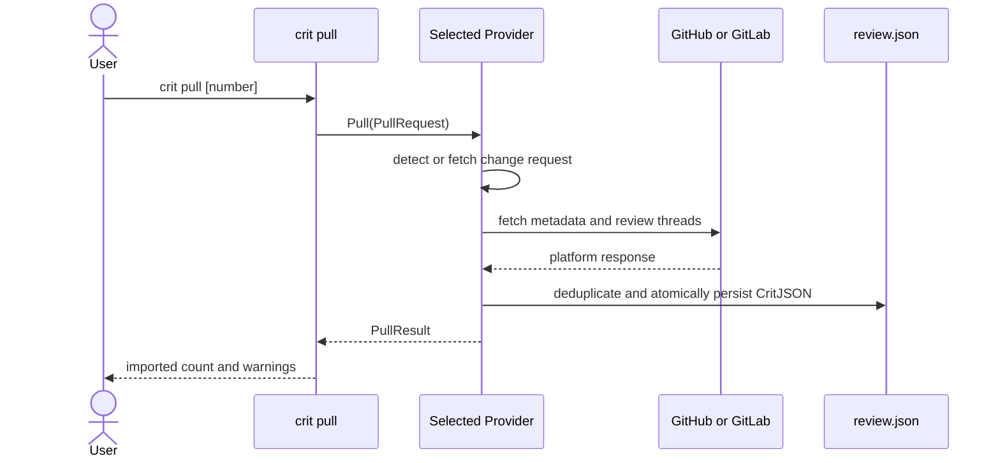
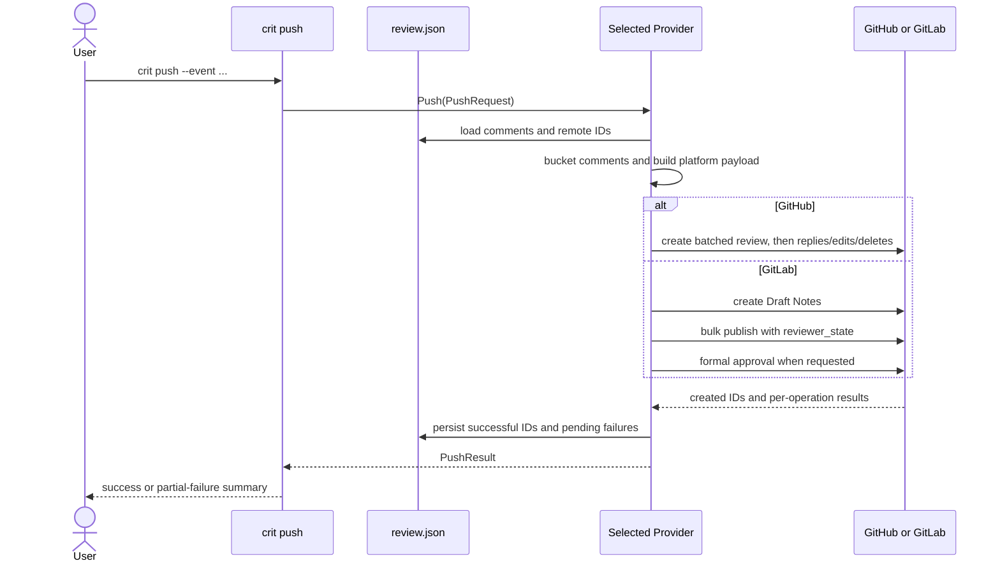

# GitLab Integration Plan

## Goal

Add full GitLab parity for Crit's existing GitHub review workflow while preserving the current GitHub implementation and behavior.

The first release should let users:

- Open and review an existing GitLab merge request with `crit mr <iid|url>` or `crit review --mr <iid|url>`.
- Pull GitLab discussions into the local Crit review file.
- Push comments, replies, edits, deletions, resolutions, approvals, and change-request feedback back to GitLab.
- Auto-detect the current merge request and use the configured GitLab host.
- Use both gitlab.com and self-managed GitLab instances.
- Use the existing stacked-change picker, branch handling, and cross-fork file loading.

Creating a new PR or MR is not included in this work. Crit's current GitHub integration reviews and synchronizes existing PRs; it does not create them.

## Current Architecture and Proposed Design

Today the forge boundary is implicit and GitHub-specific:



The useful existing seams are:

- `cmd/crit/cli_handlers.go` directly dispatches `pull`, `push`, and `pr` to `internal/github`.
- `cmd/crit/wire.go` already converts `github.PRInfo` to the neutral `focus.PRResolveInfo` and injects cache/focus hooks.
- `internal/server/types.go` and `internal/live/types.go` alias GitHub metadata and comment types.
- `internal/github/export.go` exposes the current fetch, merge, submit, reply, edit, delete, bucketing, and ID-persistence operations.
- `internal/github` uses `vcs.VCS` only for repository operations such as default-branch and SHA handling; GitLab must reuse that layer rather than duplicate branch logic.

Add `internal/forge` as the shared interface, normalized-type, and forge-command orchestration package. The thin `cmd/crit` handlers delegate pull, push, PR, and MR commands to it; only the composition root imports the concrete providers. `internal/github` directly implements the interface in a new `provider.go` file whose methods call the package's existing functions; there is no separate GitHub adapter package or component. The new `internal/gitlab` package implements the same interface with `glab`. Both providers continue using `internal/session` for CritJSON and `vcs.VCS` for repository operations.



### Provider Interface

The interface stays at Crit's existing feature boundary. `PullRequest` and `PushRequest` contain the resolved repository, change ID, review path, scope, event/message flags, and dry-run setting. Providers own the API-specific workflow and return the same normalized result shapes:

```go
package forge

type Provider interface {
    Kind() Kind
    RequireAuth(ctx context.Context, repo RepoContext) error
    Detect(ctx context.Context, repo RepoContext) (ChangeID, error)
    Get(ctx context.Context, repo RepoContext, id ChangeID) (ChangeRequest, error)
    ListOpen(ctx context.Context, repo RepoContext) ([]ChangeSummary, error)
    Pull(ctx context.Context, request PullRequest) (PullResult, error)
    Push(ctx context.Context, request PushRequest) (PushResult, error)
    FetchFile(ctx context.Context, repo RepoContext, source RepoRef, sha, path string) ([]byte, error)
    Invalidate(id ChangeID)
}
```

`PullResult` reports imported/updated/skipped counts and warnings. `PushResult` reports created, edited, deleted, replied, and resolved operations, mapping Crit local IDs to remote references so partial success can be persisted safely. The CLI parses flags once and calls `provider.Pull` or `provider.Push`; it never switches on GitHub versus GitLab.

`RemoteRef` contains a provider kind plus opaque `CommentID` and `ThreadID` strings. GitHub fills only the comment ID; GitLab fills both note and discussion IDs. API-specific payloads such as GitHub `side` or GitLab `position` never escape the provider.

Provider selection happens in `cmd/crit/wire.go`, where both concrete packages can be imported without creating an import cycle. A small forge-kind detector applies the explicit `forge` setting first and then inspects the origin remote; `wire.go` constructs `github.Provider` or `gitlab.Provider` and injects it through the existing hooks. The GitLab provider receives the single configured `gitlab_url` (default `https://gitlab.com`). `focus`, `server`, and `session` therefore depend only on neutral forge types.

`internal/github.Provider` translates the normalized requests/results to its package's existing implementation; it does not rewrite that implementation. GitLab implements the same contract directly. Stable CritJSON helpers may be extracted only when both providers need the exact same operation.

### Pull Sequence



### How Push Is Normalized

The providers implement the same `Push(PushRequest) (PushResult, error)` operation even though the hosting APIs model a review differently:

| Concern | GitHub provider | GitLab provider | Normalized Crit behavior |
| --- | --- | --- | --- |
| Change metadata | `gh pr view --json`; PR number and base/head OIDs | `glab api` MR endpoint; IID and `diff_refs` | Map both to `ChangeRequest` and `ChangeID` |
| New inline comments | One batched `POST .../pulls/:number/reviews` | Create one Draft Note per comment with `position` | One `PushRequest` containing all new comments |
| Submit outcome | Review `event=COMMENT/APPROVE/REQUEST_CHANGES` | `draft_notes/bulk_publish` with `reviewer_state=reviewed/requested_changes`; approvals endpoint for formal approval | One event enum: `comment`, `approve`, or `request-changes` |
| Thread identity | Numeric review-comment ID; replies use parent comment ID | Discussion ID plus numeric note ID | Opaque `RemoteRef{CommentID, ThreadID}` |
| Thread resolution | Fetch resolution with GitHub GraphQL; comment REST for mutations | Discussion response exposes resolution; update discussion to resolve/reopen | Boolean resolved state and a provider-owned mutation |
| Replies/edits/deletes | GitHub comment endpoints | GitLab discussion-note endpoints | Counts and remote references returned in `PushResult` |
| Partial failure | Existing GitHub push records successful IDs and pending failures | Draft creation can fail before bulk publish; reconcile Crit-owned drafts before retry | Persist every confirmed success and make retries idempotent |

The GitLab provider performs the required translation internally: Crit line anchors become GitLab `position`/`line_range`, Crit comment IDs are associated with Draft Notes during staging, bulk publication produces discussions, and those resulting discussion/note IDs are converted back to `RemoteRef`. The caller sees the same `PushResult` it receives from GitHub.

### Push Sequence



## Shared Review Model

PR and MR metadata map into one neutral change-request type containing the fields Crit already consumes: number/IID, URL, title, draft state, lifecycle state, body, source and target refs, base/head SHAs, repository identity, author, timestamps, and change statistics.

Remote comments map into one normalized thread model containing:

- Platform and remote identifiers.
- File path and old/new side.
- Start and end lines.
- Body and author.
- Creation time.
- Replies and resolved state.

Keep the existing `github_id` fields unchanged for review-file and crit-web compatibility. Add GitLab-specific fields because GitLab requires both identifiers to address a note:

- `gitlab_note_id`
- `gitlab_discussion_id`

The shared CritJSON-side logic should handle bucketing, deduplication, local merge, edit detection, and pending deletes. Platform providers should only translate API requests and responses.

Any GitLab pull path must apply the same local-ID and fingerprint deduplication guarantees as GitHub and crit-web imports, so repeated pulls remain idempotent.

## GitLab Transport and Host Detection

Use the authenticated `glab` CLI instead of handling GitLab tokens directly.

Crit configures one GitLab base URL through `gitlab_url`, defaulting to `https://gitlab.com`. Set it once to use a self-managed instance. Every GitLab operation passes that host to the authenticated `glab` CLI; a full MR URL remains an accepted change identifier, but its host must match `gitlab_url` rather than selecting a different host for that invocation. Use `glab api` and its `:fullpath` placeholder so nested GitLab subgroups work correctly.

Add a project-overridable `forge` config value:

- `auto` (default)
- `github`
- `gitlab`

Add a project-overridable `gitlab_url` string with `https://gitlab.com` as its default.

Detection precedence:

1. Explicit CLI or config selection.
2. Recognized origin-remote host and authenticated CLI context, using `gitlab_url` for GitLab transport.
3. Existing GitHub behavior as the compatibility default.

Require authenticated `gh` only for GitHub operations and authenticated `glab` only for GitLab operations.

## GitLab Comment Semantics

GitLab inline notes require a diff position containing the merge request's `base_sha`, `start_sha`, and `head_sha`, old/new paths, and the appropriate old or new line.

Multiline comments additionally require a `line_range` and GitLab `line_code`. Validate this encoding against the sandbox before finalizing the serializer because GitLab rejects invalid positions rather than relocating them.

Comments whose stored SHA or line position no longer maps to the current MR diff must remain local and appear in Crit's existing unpushable/orphan reporting.

Use GitLab's Draft Notes API for a pending review instead of publishing each discussion immediately. Create every inline comment under `/draft_notes`, then submit the review through `/draft_notes/bulk_publish`. This gives Crit the same user-visible operation as GitHub: comments and the review outcome are published together.

Map review events as follows:

- `comment`: bulk-publish the draft notes with `reviewer_state=reviewed` and the optional summary note.
- `approve`: bulk-publish the draft notes with `reviewer_state=reviewed`, then call the Merge Request Approvals API to record the formal approval.
- `request-changes`: bulk-publish the draft notes with `reviewer_state=requested_changes`, which records a real GitLab change request and blocks merging when that feature is available.

Creating the Draft Notes can partially fail before submission. Keep the review unpublished when any draft creation fails, report which comments failed, and allow the user to retry or discard it. After a successful bulk publish, fetch the resulting discussions and persist their discussion/note identifiers. Retrying must reconcile existing Crit-owned draft notes and must not duplicate them.

Request Changes is available on GitLab Premium and Ultimate. Detect an unsupported instance/tier response and explain that the comments remain unpublished; never silently downgrade a requested-changes review to a normal comment or an unapprove action.

## CLI and UI

- Add `crit mr <iid|url>` as the GitLab counterpart to `crit pr`.
- Add `--mr` alongside `--pr` for explicit review focus.
- Keep `crit pull` and `crit push` forge-neutral.
- Generalize user-facing PR wording where it represents either platform.
- Label imported comments as GitHub or GitLab based on their persisted remote identity.
- Include GitLab CLI/authentication status in `crit check` when GitLab is selected.
- Document `glab auth login`, self-managed hosts, MR review commands, and GitLab sync behavior.

Browser Finish/Approve remains local and agent-facing in this plan, matching current GitHub behavior. A separate follow-up can add browser-to-forge submission with `Request Changes` and `Approve` actions, but that flow must call the same `Provider.Push` contract for both GitHub and GitLab rather than add a GitLab-only UI path.

## Delivery Sequence

1. Add neutral interface and normalized types, then make `internal/github.Provider` implement it in a new file by calling the existing GitHub functions. Route existing consumers through the provider without changing GitHub behavior.
2. Add GitLab authentication, detection, MR metadata, focus mode, open-MR picker, remote file loading, and comment pulling.
3. Add GitLab push: inline discussions, multiline positions, replies, edits, deletes, resolution, approval events, and partial-failure recovery.
4. Add documentation, UI labels, self-managed-host coverage, and the full GitLab roundtrip suite.

Each stage should remain reviewable and keep `go test ./...` green. Do not combine the GitHub provider wiring and all GitLab mutation behavior into one undifferentiated change.

## Test Plan

Run for every stage:

```bash
go test ./...
gofmt -l .
golangci-lint run ./...
```

Before declaring the implementation complete, also run:

- Keep the existing `e2e_github` roundtrip harness unchanged as the compatibility gate. It creates one temporary branch and PR per scenario, drives the real `crit pull`/`crit push` commands, checks both the local review JSON and live GitHub state through `gh api`, and closes the PR/deletes the branch in cleanup. Run all existing idempotency, reply, edit, resolve, delete, force-push, range, three-way-merge, and outdated-anchor scenarios.
- Add a parallel `e2e_gitlab` harness against `gitlab.com/crit-md/crit-roundtrip-sandbox`. It should create one temporary branch and MR per scenario, use `glab api` for setup/assertions/cleanup, and share only platform-neutral fixture and assertion helpers with the GitHub harness.
- Add GitLab-specific assertions for Draft Notes before submission, bulk-published discussions afterward, `reviewer_state=requested_changes`, formal approval state, and recovery from a failed draft-note batch. Do not force GitLab into GitHub's review-ID assumptions.
- Repeated pull and repeated push tests proving idempotency.
- Added, deleted, renamed, multiline, stale-SHA, and cross-fork comment scenarios.
- Reply, edit, delete, resolve, approve, and request-changes scenarios.
- Partial push failure followed by successful retry without duplication.
- gitlab.com default, configured self-managed host, and mismatched-MR-URL rejection tests.
- Review-file and crit-web serialization compatibility tests for existing `github_id` data.

## Acceptance Criteria

- Existing GitHub commands and persisted reviews behave exactly as before.
- A user authenticated with `glab` can review, pull, and push an existing GitLab MR.
- GitLab comments preserve threading, line placement, resolution, and remote identifiers.
- Repeated synchronization does not duplicate comments.
- Partial GitLab failures are recoverable and visible.
- Self-managed GitLab works through the one configured `gitlab_url` and authenticated `glab` host.
- Both GitHub and GitLab live roundtrip suites pass.
