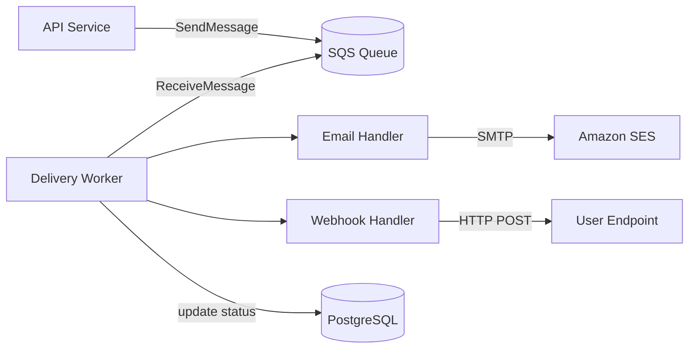

# Notification Service

## Overview

This plan covers adding a notification delivery system to the platform. Users currently
receive no alerts for events that happen while they're offline - plan approvals,
comment mentions, deployment completions. We're building a persistent queue-backed
delivery system supporting email and webhook channels. In-app real-time notifications
are deferred to Phase 2.

This is a greenfield service, running as a separate process alongside the main API
and communicating over an internal message queue.

## Design Decisions

These are the choices we need to commit to before writing code.

| Decision           | Options considered           | Chosen        | Rationale                                                      |
| ------------------ | ---------------------------- | ------------- | -------------------------------------------------------------- |
| Queue              | Redis Streams, SQS, RabbitMQ | SQS           | Durable by default; no AOF config needed; we're already on AWS |
| Delivery guarantee | At-least-once, at-most-once  | At-least-once | Idempotency keys handle duplicates                             |
| Template engine    | Handlebars, Mustache, MJML   | Handlebars    | Lowest complexity for text and HTML templates                  |
| Storage            | PostgreSQL, DynamoDB         | PostgreSQL    | Consistent with the rest of the stack                          |

## Database Schema

```sql
CREATE TABLE notifications (
    id          UUID PRIMARY KEY DEFAULT gen_random_uuid(),
    user_id     UUID NOT NULL REFERENCES users(id) ON DELETE CASCADE,
    type        VARCHAR(64) NOT NULL,
    title       TEXT NOT NULL,
    body        TEXT,
    metadata    JSONB DEFAULT '{}',
    read_at     TIMESTAMPTZ,
    created_at  TIMESTAMPTZ DEFAULT now()
);

CREATE TABLE notification_deliveries (
    id                UUID PRIMARY KEY DEFAULT gen_random_uuid(),
    notification_id   UUID NOT NULL REFERENCES notifications(id) ON DELETE CASCADE,
    channel           VARCHAR(32) NOT NULL,       -- 'email' | 'webhook'
    status            VARCHAR(32) NOT NULL DEFAULT 'pending',
    attempts          INT DEFAULT 0,
    last_attempted_at TIMESTAMPTZ,
    delivered_at      TIMESTAMPTZ,
    error             TEXT,
    created_at        TIMESTAMPTZ DEFAULT now()
);

CREATE INDEX idx_notifications_user_id ON notifications(user_id);
CREATE INDEX idx_deliveries_notification_id ON notification_deliveries(notification_id);
CREATE INDEX idx_deliveries_status ON notification_deliveries(status, attempts)
    WHERE status = 'pending';
```

## API

### POST /notifications/send

Enqueues a notification for async delivery. Called by other internal services - not
exposed to end users. Requires `X-Internal-Token` header; requests without it are
rejected with 401 before hitting the queue.

```json
{
  "user_id": "uuid",
  "type": "plan.approved",
  "title": "Your plan was approved",
  "body": "The auth service plan was approved by Sarah.",
  "channels": ["email", "webhook"],
  "metadata": { "plan_id": "uuid" }
}
```

Returns `202 Accepted` immediately. Delivery happens asynchronously.

### GET /notifications

Returns the authenticated user's notification feed. Paginated with cursor, newest first.

```
GET /notifications?limit=20&before=<cursor>
```

### POST /notifications/:id/read

Marks a single notification as read.

### POST /notifications/read-all

Marks all unread notifications as read. Rate limited to 10 requests per minute per user.

## Worker Design

The delivery worker runs as a separate long-lived process. It reads from the SQS queue
and dispatches to channel handlers. Handlers are pluggable - email and webhook ship in
the MVP, others (Slack, SMS) can be added later without changing the worker core.



## Retry Strategy

Failed deliveries are retried with exponential backoff. The worker polls for rows where
`status = 'pending'` and `last_attempted_at < now() - interval`.

| Attempt | Delay before retry |
| ------- | ------------------ |
| 1       | Immediate          |
| 2       | 30 seconds         |
| 3       | 5 minutes          |
| 4       | 30 minutes         |
| 5       | 30 minutes         |

After 5 failed attempts, the delivery is marked `permanently_failed`. The user's
notification feed still shows the item; only delivery is abandoned.

## Webhook Delivery

Webhook requests time out after **3 seconds**. On a 4xx response (excluding 429),
retries stop - the endpoint is likely misconfigured. On 5xx or timeout, normal
backoff applies.

Each request includes `X-Notification-Signature`: an HMAC-SHA256 of the JSON body
signed with the user's webhook secret. Receivers should verify this before processing.

## MVP Checklist

- [ ] Database schema and migrations
- [ ] POST /notifications/send
- [ ] Rate limit POST /notifications/send (per X-Internal-Token, 100 req/min)
- [ ] GET /notifications feed with cursor pagination
- [ ] POST /notifications/:id/read and POST /notifications/read-all
- [ ] Email delivery via SES
- [ ] Webhook delivery with HMAC signature verification
- [ ] Retry worker with exponential backoff
- [ ] Integration tests for the delivery pipeline
- [ ] Runbook: how to inspect and manually retry stuck deliveries

## Out of Scope

- In-app real-time notifications (WebSockets / SSE) - Phase 2
- Notification preferences UI - Phase 2
- SMS and Slack channels - future
- Notification grouping and digest emails - future

## Open Questions

- Should the webhook worker and email worker run as separate processes, or one worker
  dispatching to both?
- Is there a maximum size we need to enforce on the `metadata` field? The schema is
  currently unbounded and this should be decided before the migration runs.
- Do we need a way for users to test their webhook endpoint from the UI?
