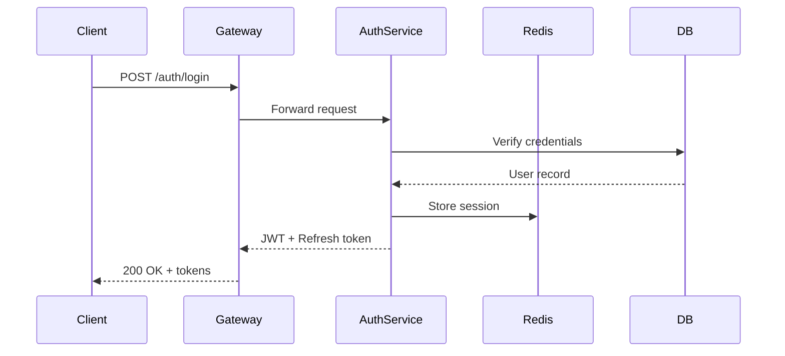

# Gatekeeper — Authentication Service Plan

## Overview

This document outlines the plan for building a new authentication service
that supports OAuth2 and magic link authentication.

> **Note**: This plan covers the MVP scope. SAML integration is deferred to Phase 3
> per product confirmation — not prioritised for the enterprise tier launch.

## Architecture

The service will be built as a standalone microservice with its own
PostgreSQL database. It exposes a gRPC API consumed by the API gateway,
with a REST shim for backwards compatibility.

### Components

1. **Auth API** — handles login, logout, token refresh
2. **Token Service** — JWT issuance and validation
3. **Provider Adapters** — pluggable OAuth2 providers
4. **Session Store** — Redis-backed session management
5. **Audit Logger** — async event streaming to Kafka

### Tech Stack Comparison

| Component   | Option A       | Option B      | Decision   |
| ----------- | -------------- | ------------- | ---------- |
| Language    | Elixir/Phoenix | Go            | Go         |
| Database    | PostgreSQL     | CockroachDB   | PostgreSQL |
| Cache       | ETS            | Memcached     | Redis      |
| Auth tokens | JWT            | Opaque tokens | JWT        |

## Database Schema

The core tables are:

- `users` — basic user identity
- `credentials` — password hashes, OAuth tokens
- `sessions` — active sessions with expiry
- `audit_log` — all auth events for compliance

```sql
CREATE TABLE users (
    id UUID PRIMARY KEY DEFAULT gen_random_uuid(),
    email VARCHAR(255) UNIQUE NOT NULL,
    email_verified_at TIMESTAMPTZ,
    created_at TIMESTAMPTZ DEFAULT now(),
    updated_at TIMESTAMPTZ DEFAULT now()
);

CREATE TABLE sessions (
    id UUID PRIMARY KEY DEFAULT gen_random_uuid(),
    user_id UUID REFERENCES users(id) ON DELETE CASCADE,
    token_hash VARCHAR(64) NOT NULL,
    expires_at TIMESTAMPTZ NOT NULL,
    ip_address INET,
    user_agent TEXT,
    created_at TIMESTAMPTZ DEFAULT now()
);

-- Indexes
CREATE INDEX idx_sessions_user_id ON sessions(user_id);
CREATE INDEX idx_sessions_expires_at ON sessions(expires_at);
CREATE UNIQUE INDEX idx_sessions_token_hash ON sessions(token_hash);
```

## API Endpoints

### POST /auth/login

Accepts email/password. Returns a JWT access token
and a refresh token. Rate limited to 10 attempts per minute per IP.

```json
{
  "email": "user@example.com",
  "password": "...",
  "provider": null
}
```

### POST /auth/refresh

Accepts a valid refresh token, returns a new access/refresh pair.
Refresh tokens are single-use and rotate on each call.

### DELETE /auth/session

Invalidates the current session. Supports optional `all=true` param
to invalidate all sessions for the user (global logout).

### GET /auth/me

Returns the current user's profile. Requires a valid access token.

## MVP Checklist

- [x] Design database schema
- [x] Set up project scaffolding
- [x] Implement login endpoint
- [x] Implement token refresh
- [ ] Implement logout / session invalidation
- [ ] Add rate limiting
- [ ] Write integration tests
- [ ] Deploy to staging

## Auth Flow



## Architecture


## Deployment

Deployed as a Docker container on our existing k8s cluster.
Uses Vault for secret management and certificate rotation.
Blue-green deployments via Argo Rollouts.

---

## Open Questions

- Going passwordless-only — confirmed with product, password auth is out of scope.
- Session TTL: 7 days for magic link, 1 hour for OAuth access tokens.
- Do we need to support SAML for the MVP, or can it wait?
